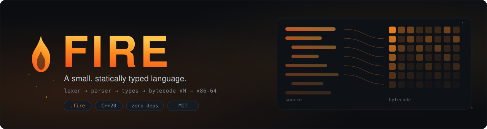
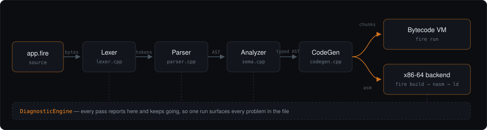

<div align="center">



<br>

[](LICENSE)
[](CMakeLists.txt)
[](Makefile)
[](tests)
[](#building)

**[Getting started](docs/getting-started.md) · [Language reference](docs/language-reference.md) · [Architecture](docs/architecture.md) · [Bytecode](docs/bytecode.md) · [CLI](docs/cli.md)**

</div>

---

**Fire** is a small, statically typed programming language, and the compiler
that runs it. Source files end in `.fire`. The compiler is about 8,800 lines of
dependency-free C++20: a hand-written lexer, a recursive-descent parser, a type
checker with inference, a bytecode compiler, a virtual machine, **and** a native
x86-64 backend that produces a freestanding Linux executable.

It is written to be read. Every pass is one file with one job, and the comments
explain the decisions rather than restating the code.

```fire
// hello.fire
fn greet(name: str) -> str {
    return "Hello, " + name + "!";
}

for language in ["Fire", "world"] {
    println(greet(language));
}
```

```console
$ fire run hello.fire
Hello, Fire!
Hello, world!
```

## Contents

- [Quick start](#quick-start)
- [What the language looks like](#what-the-language-looks-like)
- [What the compiler does](#what-the-compiler-does)
- [Two backends](#two-backends)
- [Errors](#errors)
- [Examples](#examples)
- [The `fire` command](#the-fire-command)
- [Building](#building)
- [Testing](#testing)
- [Performance](#performance)
- [Editor support](#editor-support)
- [Project layout](#project-layout)
- [What Fire is not](#what-fire-is-not)
- [License](#license)

## Quick start

```console
$ git clone https://github.com/Adii-5442/Compiler.FIRE.git
$ cd Compiler.FIRE
$ make
built bin/fire

$ ./bin/fire run examples/fizzbuzz.fire
$ ./bin/fire repl
```

A C++20 compiler and `make` are all you need. `nasm` and `ld` are used only by
`fire build`, and only when you ask for a native executable.

The full walkthrough — writing a program, breaking it on purpose, compiling it
to a static binary, and looking at every intermediate form — is in
**[docs/getting-started.md](docs/getting-started.md)**.

## What the language looks like

Fire is deliberately small. If you have written C, Rust or Go, you already know
almost all of it.

```fire
// Types are inferred but real. `let` is mutable, `const` is not.
let count = 0;
const limit: int = 100;

// Five types: int, float, bool, str, and arrays of any of them.
let name = "fire";
let ratio = 0.75;
let flags: [bool] = [true, false];
let grid: [[int]] = [[1, 2], [3, 4]];

// Functions annotate their parameters; the return type follows `->`.
fn clamp(value: int, low: int, high: int) -> int {
    return min(max(value, low), high);
}

// if / elif / else, while, and two forms of for.
for i in 0..10 { }              // an integer range
for c in "fire" { }             // each character
for row in grid { }             // each element

// Arrays are references, so a callee's push is visible to its caller.
fn fill(target: [int], upto: int) {
    for i in 0..upto { push(target, i * i); }
}

let squares: [int] = [];
fill(squares, 5);
println(squares);               // [0, 1, 4, 9, 16]
```

Two things Fire deliberately does *not* have:

```fire
let x = 1 + 2.0;   // error: no implicit conversion. Write float(1) + 2.0.
if count { }       // error: no truthiness. Write count != 0.
```

Both rules exist because the alternative silently does something a reader has
to guess at. The compiler names the fix in each case.

See **[the language reference](docs/language-reference.md)**, or
[`examples/tour.fire`](examples/tour.fire) for every feature in one runnable
file.

## What the compiler does

<div align="center">

</div>

| Stage | File | What it produces |
| --- | --- | --- |
| Lexer | [`src/lexer.cpp`](src/lexer.cpp) | tokens with decoded literals and source spans |
| Parser | [`src/parser.cpp`](src/parser.cpp) | an AST, with `elif` already desugared |
| Analyzer | [`src/sema.cpp`](src/sema.cpp) | types on every node, slots on every name, targets on every call |
| CodeGen | [`src/codegen.cpp`](src/codegen.cpp) | bytecode chunks |
| VM | [`src/vm.cpp`](src/vm.cpp) | the program's output |
| x86-64 | [`src/backend_x86_64.cpp`](src/backend_x86_64.cpp) | NASM assembly, then an ELF executable |

Each intermediate form is one flag away:

```console
$ fire emit --tokens    hello.fire
$ fire emit --ast       hello.fire      # with inferred types and resolved slots
$ fire emit --bytecode  hello.fire
$ fire emit --asm       hello.fire
$ fire run   --trace    hello.fire      # disassembles each instruction as it runs
```

**[docs/architecture.md](docs/architecture.md)** walks through the pipeline and
records why each decision was made — why spans are byte offsets, why the
analyzer restores its slot cursor when a scope closes, why jump targets are
absolute, why arithmetic opcodes are type-specialised.

## Two backends

**The bytecode VM** (`fire run`) is the primary target and supports the whole
language. Because the type checker has already proved every operation, the
interpreter loop does no type dispatch at all: `ADD_I` adds two integers
because it could only have been emitted where both operands are integers.

**The native backend** (`fire build`) emits freestanding NASM assembly — no
libc, entry point `_start`, two syscalls — and hands it to `nasm` and `ld`.

```console
$ fire build examples/native.fire -o collatz
wrote collatz
$ ./collatz
longest Collatz chain under 10000
  start: 6171  steps: 261
$ ldd collatz
        not a dynamic executable
```

It covers a documented subset: `int` and `bool` throughout, string literals
passed to `print`/`println`, every operator, all control flow, and functions
including recursion. Anything outside it is reported *by name*, rather than
miscompiled:

```
error[N0001]: the native backend does not support arrays
   = note: arrays need a heap allocator this backend has none of
   = help: run this program on the Fire VM instead: `fire run <file.fire>`
```

The test suite compiles `tests/native/*.fire` **both** ways and diffs the
results, which is what stops the two backends quietly disagreeing.

## Errors

Fire never stops at the first problem, and every diagnostic carries a stable
code, the source line, a caret under the exact expression, and — where there is
one — the fix.

```
error[E0201]: cannot apply `+` to `int` and `str`
 --> app.fire:4:13
  |
4 |     let x = 1 + "two";
  |             ^^^^^^^^^ arithmetic needs two `int` or two `float`
  |
  = help: convert the other operand with `str(x)` to concatenate

error[E0221]: cannot find function `prinln`
 --> app.fire:9:1
  |
9 | prinln("typo");
  | ^^^^^^ not found in this scope
  |
  = help: did you mean `println`?
```

Runtime faults are reported the same way, with a stack backtrace:

```
error[R0001]: runtime error: index 5 is out of bounds for an array of length 2
 --> app.fire:6:44
  |
6 | fn get(xs: [int], i: int) -> int { return xs[i]; }
  |                                           ^^^^^ while evaluating this
  |
  = help: valid indices run from 0 to len(xs) - 1
stack backtrace:
  0: get at app.fire:6:44
  1: <script> at app.fire:8:9
```

Every code is documented in **[docs/diagnostics.md](docs/diagnostics.md)**.

## Examples

Each one is written to be read as much as run.

| Example | Shows |
| --- | --- |
| [`hello.fire`](examples/hello.fire) | the smallest complete program |
| [`tour.fire`](examples/tour.fire) | every feature of the language, in one file |
| [`fizzbuzz.fire`](examples/fizzbuzz.fire) | control flow |
| [`fibonacci.fire`](examples/fibonacci.fire) | recursion, iteration and memoisation compared |
| [`primes.fire`](examples/primes.fire) | the sieve, cross-checked against trial division |
| [`sorting.fire`](examples/sorting.fire) | four sorts and a binary search over shared arrays |
| [`strings.fire`](examples/strings.fire) | the string library, and palindromes built on it |
| [`matrix.fire`](examples/matrix.fire) | nested arrays, multiply and transpose |
| [`mandelbrot.fire`](examples/mandelbrot.fire) | float arithmetic and escape-time rendering |
| [`calculator.fire`](examples/calculator.fire) | **a recursive-descent parser written in Fire** |
| [`wordfreq.fire`](examples/wordfreq.fire) | a stdin filter with parallel-array counting |
| [`guessing_game.fire`](examples/guessing_game.fire) | `input()`, `args()` and the seeded RNG |
| [`native.fire`](examples/native.fire) | the subset `fire build` lowers to a real executable |

```console
$ make examples          # runs all of them; several assert their own results
```

`calculator.fire` is the one worth reading: it is a recursive-descent expression
evaluator, the same shape as the parser in `src/parser.cpp`, written in the
language this compiler compiles.

## The `fire` command

```
fire run    <file>          compile and execute on the VM
fire build  <file> -o out   compile to a native x86-64 executable
fire check  <file>          type-check only
fire emit   <file> --ast    print an intermediate form
fire repl                   interactive session
fire builtins               list the 39 builtin functions
```

`fire app.fire` with no verb means `run`. Arguments after `--` go to the
program. Full reference in **[docs/cli.md](docs/cli.md)**.

## Building

```console
$ make                    # bin/fire, optimised
$ make test               # unit and end-to-end suites
$ make examples           # runs every program in examples/
$ make bench              # times both backends
$ make SANITIZE=1 test    # the whole suite under ASan and UBSan
$ make install            # to /usr/local/bin, or PREFIX=~/.local
$ make clean
```

The tree builds clean under `-Wall -Wextra -Wpedantic -Wshadow -Wconversion
-Wsign-conversion`, which is the only way that stays true.

CMake is supported for IDEs (`cmake -B build && cmake --build build`), but the
Makefile is the canonical build and needs nothing but a compiler.

| Requirement | For |
| --- | --- |
| C++20 compiler (GCC 10+, Clang 12+) | everything |
| `make` | the build |
| `nasm`, `ld` | `fire build` only |

## Testing

```console
$ make test
87 passed, 0 failed, 87 registered
22 passed, 0 failed
all end-to-end tests passed
```

Two suites:

- **Unit tests** (`tests/unit/`) over the lexer, parser, analyzer, VM, value
  model and builtin library, on a small framework written for the purpose —
  Fire has no dependencies, and a test runner was not a good reason to acquire
  the first one.
- **End-to-end tests** (`tests/cases/`) where each case is a real Fire program
  carrying its own expectations as comments, so a test and the thing it tests
  cannot drift apart in separate files:

  ```fire
  //exit 70
  //= before
  //~ runtime error: index 5 is out of bounds
  ```

  Programs under `tests/cases/errors/` must *fail* to compile and assert
  diagnostic codes; programs under `tests/native/` are compiled by both
  backends and diffed against each other.

## Performance

```console
$ tools/bench.sh
program                  vm     native   notes
---------------------------------------------------------------
arrays               0.328s        n/a   outside the native backend's subset
fib                  0.175s     0.007s
iterate              0.300s        n/a   outside the native backend's subset
loops                0.658s     0.021s
```

Four microbenchmarks isolating call overhead, dispatch, array access and
builtin call cost. They exist to answer *did that change help?*, not *how fast
is Fire?* — see [`bench/README.md`](bench/README.md).

The gap between the columns is the honest cost of a bytecode interpreter, and
the reason the native backend is worth having even for the subset it covers.

## Editor support

Syntax highlighting for `.fire` files ships in [`editors/`](editors/): a Vim
syntax file, and a VS Code extension whose TextMate grammar also works in
Sublime, Zed and anything else that reads them.

Both follow the real lexer — nesting block comments, validated escape
sequences, all four integer bases — and highlight builtins only in call
position, because they are not reserved words.

## Project layout

```
include/fire/     public headers, one per pass
src/              the compiler
  lexer.cpp         bytes  → tokens
  parser.cpp        tokens → AST
  sema.cpp          AST    → typed, resolved AST
  codegen.cpp       AST    → bytecode
  vm.cpp            bytecode → output
  backend_x86_64.cpp  AST  → NASM assembly
  natives.cpp         builtin signatures (compile time)
  natives_runtime.cpp builtin implementations (run time)
  diagnostics.cpp     error collection and rendering
  driver.cpp          the pipeline, plus --tokens and --ast dumps
  repl.cpp            the interactive session
  main.cpp            the command-line interface
examples/         13 programs, written to be read
tests/            unit tests, end-to-end cases, and their runners
bench/            microbenchmarks, run by tools/bench.sh
docs/             language reference, grammar, architecture, bytecode, CLI
editors/          Vim and VS Code syntax highlighting
assets/           the banner and pipeline diagram, hand-written SVG
```

## What Fire is not

Stated plainly, because a language that pretends to be finished is worse than
one that says where it stops.

- **No closures or first-class functions.** Calls resolve at compile time,
  which is what removes captured environments, escape analysis and a garbage
  collector for them from the design — and what lets the native backend emit a
  direct `call`.
- **No structs, maps or generics.** Arrays and the five scalar types are the
  whole type system. `examples/wordfreq.fire` shows the parallel-array shape you
  reach for instead of a map.
- **No modules.** One file is one program.
- **No optimiser.** Codegen is a direct lowering. No constant folding, no
  register allocation, no dead code elimination.
- **Reference cycles leak.** Arrays are reference counted; an array pushed into
  itself will not be freed. A tracing collector is not worth its complexity for
  a language with no closures and no user-defined aggregates.
- **The native backend covers a subset**, and says so by name rather than
  miscompiling.

## License

MIT. See [LICENSE](LICENSE).
